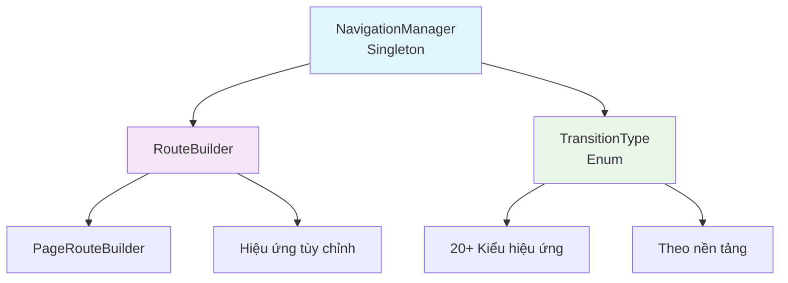

# 🧭 Hệ thống Điều hướng

[](https://flutter.dev)
[](https://dart.dev)
[](LICENSE)

> 🇻🇳 Tiếng Việt | [🇬🇧 English](./README.md)

---

## ⚡ Bắt đầu nhanh

```dart
// 1. Thiết lập trong main.dart
MaterialApp(
  navigatorKey: NavigationManager.instance.navigatorKey,
  home: HomeScreen(),
)

// 2. Điều hướng bất cứ đâu
NavigationManager.instance.navigateTo(
  ProfileScreen(),
  transition: TransitionType.slideRight,
);

// 3. Xử lý kết quả trả về
final result = await NavigationManager.instance.navigateTo<String>(
  EditScreen(),
);
```

---

## 📋 Mục lục

- [⚡ Bắt đầu nhanh](#-bắt-đầu-nhanh)
- [🎯 Giới thiệu](#-giới-thiệu)
- [🏗️ Kiến trúc](#️-kiến-trúc)
- [📁 Cấu trúc files](#-cấu-trúc-files)
- [🚀 Các phương thức điều hướng](#-các-phương-thức-điều-hướng)
- [🎨 Các loại hiệu ứng](#-các-loại-hiệu-ứng)
- [💡 Ví dụ sử dụng](#-ví-dụ-sử-dụng)
- [✅ Thực hành tốt](#-thực-hành-tốt)
- [🎓 Mẹo nâng cao](#-mẹo-nâng-cao)
- [🐛 Khắc phục sự cố](#-khắc-phục-sự-cố)
- [📚 Tài liệu tham khảo](#-tài-liệu-tham-khảo)

---

## 🎯 Giới thiệu

<div align="center">

### 🚀 **Hệ thống Điều hướng Mạnh mẽ & Linh hoạt**

Giải pháp điều hướng toàn diện cho ứng dụng Flutter với **hiệu ứng đẹp mắt**, **type safety**, và **API trực quan**.

</div>

---

### ✨ Tính năng chính

| Tính năng                | Mô tả                                               |
| ------------------------ | --------------------------------------------------- |
| 🎨 **20+ Hiệu ứng**      | Thư viện animation phong phú với hiệu ứng tùy chỉnh |
| 📱 **Theo nền tảng**     | Hiệu ứng iOS Cupertino native                       |
| 🔄 **Kiểm soát Stack**   | Quản lý đầy đủ navigation stack                     |
| 🎭 **Tùy chỉnh**         | Điều chỉnh thời gian và easing                      |
| 💡 **Dễ sử dụng**        | API đơn giản, trực quan                             |
| 📦 **Type Safe**         | Hỗ trợ generic cho return values                    |
| 🏗️ **Singleton Pattern** | Single source of truth                              |

---

## 🏗️ Kiến trúc

<div align="center">



</div>

### 🏛️ Các thành phần hệ thống

```
🎯 NavigationManager (Singleton)
├── 🔑 navigatorKey: GlobalKey<NavigatorState>
├── 🚀 Phương thức điều hướng (8 core methods)
├── 🔄 Quản lý Stack
└── 📊 Giám sát trạng thái

🎨 RouteBuilder
├── 🏗️ Xây dựng Route
├── 🎬 Logic Animation
└── ⚙️ Cấu hình hiệu ứng

📋 TransitionType (Enum)
├── ➡️ Slide Transitions (8 types)
├── 🔄 Basic Transitions (3 types)
├── ↻ Rotation Transitions (2 types)
├── 🔗 Combined Transitions (3 types)
├── 🔍 Zoom Transitions (3 types)
└── 🍎 Platform Specific (1 type)
```

---

## 📁 Cấu trúc files

```
lib/core/navigation/
├── navigation_manager.dart    # Controller chính
├── route_builder.dart         # Xây dựng routes
├── transition_type.dart       # Các loại hiệu ứng
├── README.md                  # Tài liệu (Tiếng Anh)
└── README_VI.md              # Tài liệu (Tiếng Việt)
```

### 1. `navigation_manager.dart` (183 dòng)

Controller chính với các phương thức chuyển màn hình và quản lý stack.

### 2. `route_builder.dart` (202 dòng)

Xây dựng routes với hiệu ứng tùy chỉnh và xử lý logic animation.

### 3. `transition_type.dart` (107 dòng)

Enum định nghĩa tất cả các loại hiệu ứng với tài liệu.

---

## 🚀 Các phương thức điều hướng

### 1. `navigateTo()` - Chuyển đến màn hình mới

Đẩy màn hình mới vào stack, giữ lại màn hình cũ.

```
╔═══════════════════════════════════════════════════╗
║  📱 TRƯỚC                                         ║
╠═══════════════════════════════════════════════════╣
║                                                   ║
║    Navigation Stack:                              ║
║    ┌─────┐  ┌─────┐  ┌─────┐                     ║
║    │  A  │  │  B  │  │  C  │ ← Màn hiện tại      ║
║    └─────┘  └─────┘  └─────┘                     ║
║      ↑        ↑        ↑                          ║
║    Dưới             Trên                          ║
║                                                   ║
╚═══════════════════════════════════════════════════╝
                      ⬇
          navigateTo(ScreenD)
                      ⬇
╔═══════════════════════════════════════════════════╗
║  📱 SAU                                           ║
╠═══════════════════════════════════════════════════╣
║                                                   ║
║    Navigation Stack:                              ║
║    ┌─────┐  ┌─────┐  ┌─────┐  ┌─────┐            ║
║    │  A  │  │  B  │  │  C  │  │  D  │ ← Mới!     ║
║    └─────┘  └─────┘  └─────┘  └─────┘            ║
║      ↑        ↑        ↑        ↑                 ║
║    Dưới                       Trên                ║
║                                                   ║
║    ✅ Màn C vẫn còn trong stack                   ║
║    ✅ Có thể quay lại màn C                       ║
╚═══════════════════════════════════════════════════╝
```

**Ví dụ code:**

```dart
// Điều hướng cơ bản
NavigationManager.instance.navigateTo(ProfileScreen());

// Với hiệu ứng
NavigationManager.instance.navigateTo(
  ProfileScreen(),
  transition: TransitionType.slideUp,
  duration: const Duration(milliseconds: 400),
);

// Với kết quả trả về
final result = await NavigationManager.instance.navigateTo<String>(
  EditScreen(),
);
print(result); // "saved" hoặc null
```

---

### 2. `navigateAndReplace()` - Thay thế màn hình

Thay thế màn hình hiện tại bằng màn hình mới, xóa màn cũ khỏi stack.

```
╔═══════════════════════════════════════════════════╗
║  📱 TRƯỚC                                         ║
╠═══════════════════════════════════════════════════╣
║                                                   ║
║    Navigation Stack:                              ║
║    ┌─────┐  ┌─────┐  ┌─────┐                     ║
║    │  A  │  │  B  │  │  C  │ ← Màn hiện tại      ║
║    └─────┘  └─────┘  └─────┘                     ║
║      ↑        ↑        ↑                          ║
║    Dưới             Trên                          ║
║                                                   ║
╚═══════════════════════════════════════════════════╝
                      ⬇
      navigateAndReplace(ScreenD)
                      ⬇
╔═══════════════════════════════════════════════════╗
║  📱 SAU                                           ║
╠═══════════════════════════════════════════════════╣
║                                                   ║
║    Navigation Stack:                              ║
║    ┌─────┐  ┌─────┐  ┌─────┐                     ║
║    │  A  │  │  B  │  │  D  │ ← Đã thay thế!      ║
║    └─────┘  └─────┘  └─────┘                     ║
║      ↑        ↑        ↑                          ║
║    Dưới             Trên                          ║
║                                                   ║
║    ❌ Màn C đã bị xóa                             ║
║    ⚠️  Không thể quay lại C                       ║
╚═══════════════════════════════════════════════════╝
```

**Ví dụ code:**

```dart
// Thay thế màn hình
NavigationManager.instance.navigateAndReplace(DashboardScreen());

// Trường hợp: Sau khi login
NavigationManager.instance.navigateAndReplace(
  HomeScreen(),
  transition: TransitionType.fade,
);
```

---

### 3. `navigateAndClearAll()` - Xóa tất cả và chuyển

Xóa tất cả màn hình khỏi stack và chuyển đến màn hình mới. Thường dùng khi logout hoặc reset app.

```
╔═══════════════════════════════════════════════════╗
║  📱 TRƯỚC                                         ║
╠═══════════════════════════════════════════════════╣
║                                                   ║
║    Navigation Stack:                              ║
║    ┌───┐ ┌───┐ ┌───┐ ┌───┐ ┌───┐                ║
║    │ A │ │ B │ │ C │ │ D │ │ E │ ← Hiện tại      ║
║    └───┘ └───┘ └───┘ └───┘ └───┘                ║
║      ↑     ↑     ↑     ↑     ↑                   ║
║    Dưới                   Trên                    ║
║                                                   ║
║    📚 Nhiều màn hình trong lịch sử                ║
╚═══════════════════════════════════════════════════╝
                      ⬇
      navigateAndClearAll(LoginScreen)
                      ⬇
╔═══════════════════════════════════════════════════╗
║  📱 SAU                                           ║
╠═══════════════════════════════════════════════════╣
║                                                   ║
║    Navigation Stack:                              ║
║         ┌─────────┐                               ║
║         │  Login  │ ← Màn duy nhất                ║
║         └─────────┘                               ║
║              ↑                                    ║
║          Root & Top                               ║
║                                                   ║
║    ❌ Tất cả màn trước đã xóa                     ║
║    🔒 Bắt đầu mới (logout, reset)                 ║
║    ⚠️  Không thể quay lại                         ║
╚═══════════════════════════════════════════════════╝
```

**Ví dụ code:**

```dart
// Kịch bản logout
NavigationManager.instance.navigateAndClearAll(
  LoginScreen(),
  transition: TransitionType.fade,
);

// Reset ứng dụng
NavigationManager.instance.navigateAndClearAll(
  WelcomeScreen(),
);
```

---

### 4. `navigateAndRemoveUntil()` - Chuyển và xóa đến khi

Chuyển đến màn hình mới và xóa các màn hình cho đến khi gặp điều kiện.

```
╔═══════════════════════════════════════════════════╗
║  📱 TRƯỚC                                         ║
╠═══════════════════════════════════════════════════╣
║                                                   ║
║    Navigation Stack:                              ║
║    ┌───┐ ┌───┐ ┌───┐ ┌───┐ ┌───┐                ║
║    │ A │ │ B │ │ C │ │ D │ │ E │ ← Hiện tại      ║
║    └───┘ └───┘ └───┘ └───┘ └───┘                ║
║      ↑     ↑     ↑     ↑     ↑                   ║
║    Root                     Trên                  ║
║                                                   ║
╚═══════════════════════════════════════════════════╝
                      ⬇
   navigateAndRemoveUntil(F, isFirst)
        Điều kiện: Giữ màn đầu tiên
                      ⬇
╔═══════════════════════════════════════════════════╗
║  📱 SAU                                           ║
╠═══════════════════════════════════════════════════╣
║                                                   ║
║    Navigation Stack:                              ║
║         ┌─────┐  ┌─────┐                          ║
║         │  A  │  │  F  │ ← Màn mới                ║
║         └─────┘  └─────┘                          ║
║            ↑        ↑                             ║
║          Root     Top                             ║
║                                                   ║
║    ✅ Màn A được giữ (thỏa điều kiện)             ║
║    ❌ Màn B, C, D, E đã xóa                       ║
║    📍 Hữu ích: Về home sau quy trình              ║
╚═══════════════════════════════════════════════════╝
```

**Ví dụ code:**

```dart
// Giữ màn hình đầu tiên
NavigationManager.instance.navigateAndRemoveUntil(
  ResultScreen(),
  (route) => route.isFirst,
);

// Giữ màn home
NavigationManager.instance.navigateAndRemoveUntil(
  SuccessScreen(),
  (route) => route.settings.name == '/home',
  transition: TransitionType.slideUp,
);
```

---

### 5. `goBack()` - Quay lại màn trước

Pop màn hình hiện tại và quay về màn trước. Có thể trả dữ liệu về.

```
╔═══════════════════════════════════════════════════╗
║  📱 TRƯỚC                                         ║
╠═══════════════════════════════════════════════════╣
║                                                   ║
║    Navigation Stack:                              ║
║    ┌─────┐  ┌─────┐  ┌─────┐  ┌─────┐            ║
║    │  A  │  │  B  │  │  C  │  │  D  │ ← Hiện tại ║
║    └─────┘  └─────┘  └─────┘  └─────┘            ║
║      ↑        ↑        ↑        ↑                 ║
║    Dưới                       Trên                ║
║                                                   ║
╚═══════════════════════════════════════════════════╝
                      ⬇
        goBack() hoặc goBack<T>(result)
                      ⬇
╔═══════════════════════════════════════════════════╗
║  📱 SAU                                           ║
╠═══════════════════════════════════════════════════╣
║                                                   ║
║    Navigation Stack:                              ║
║    ┌─────┐  ┌─────┐  ┌─────┐                     ║
║    │  A  │  │  B  │  │  C  │ ← Quay lại C        ║
║    └─────┘  └─────┘  └─────┘                     ║
║      ↑        ↑        ↑                          ║
║    Dưới             Trên                          ║
║                                                   ║
║    ❌ Màn D đã xóa                                ║
║    💾 Có thể trả dữ liệu về C                     ║
║    🔙 Hành động điều hướng phổ biến nhất          ║
╚═══════════════════════════════════════════════════╝
```

**Ví dụ code:**

```dart
// Quay lại đơn giản
NavigationManager.instance.goBack();

// Trả dữ liệu
NavigationManager.instance.goBack<String>('Đã lưu người dùng');

// Ở màn trước
final result = await NavigationManager.instance.navigateTo<String>(
  EditUserScreen(),
);
if (result == 'Đã lưu người dùng') {
  // Làm mới dữ liệu
}
```

---

### 6. `popUntil()` - Pop đến khi

Pop các màn hình cho đến khi gặp điều kiện.

```
╔═══════════════════════════════════════════════════╗
║  📱 TRƯỚC                                         ║
╠═══════════════════════════════════════════════════╣
║                                                   ║
║    Navigation Stack:                              ║
║    ┌───┐ ┌───┐ ┌───┐ ┌───┐ ┌───┐                ║
║    │ A │ │ B │ │ C │ │ D │ │ E │ ← Hiện tại      ║
║    └───┘ └───┘ └───┘ └───┘ └───┘                ║
║      ↑     ↑     ↑     ↑     ↑                   ║
║    Root                     Trên                  ║
║                                                   ║
╚═══════════════════════════════════════════════════╝
                      ⬇
       popUntil((route) => route.isFirst)
          Pop đến khi gặp root
                      ⬇
╔═══════════════════════════════════════════════════╗
║  📱 SAU                                           ║
╠═══════════════════════════════════════════════════╣
║                                                   ║
║    Navigation Stack:                              ║
║              ┌─────┐                              ║
║              │  A  │ ← Quay về Root               ║
║              └─────┘                              ║
║                ↑                                  ║
║            Root & Top                             ║
║                                                   ║
║    ❌ Màn B, C, D, E đã xóa                       ║
║    🏠 Quay về màn đầu tiên                        ║
║    📍 Dùng cho: Hủy quy trình, về home nhanh     ║
╚═══════════════════════════════════════════════════╝
```

**Ví dụ code:**

```dart
// Quay về root
NavigationManager.instance.popUntil((route) => route.isFirst);

// Quay về màn cụ thể
NavigationManager.instance.popUntil(
  (route) => route.settings.name == '/home',
);
```

---

### 7. `popToRoot()` - Quay về màn đầu tiên

Pop tất cả màn hình và quay về màn đầu tiên (root).

```
╔═══════════════════════════════════════════════════╗
║  📱 TRƯỚC                                         ║
╠═══════════════════════════════════════════════════╣
║                                                   ║
║    Navigation Stack:                              ║
║    ┌──────┐ ┌───┐ ┌───┐ ┌───┐ ┌───┐             ║
║    │ Root │ │ A │ │ B │ │ C │ │ D │ ← Hiện tại   ║
║    └──────┘ └───┘ └───┘ └───┘ └───┘             ║
║       ↑       ↑     ↑     ↑     ↑                ║
║     Đầu                       Trên                ║
║                                                   ║
╚═══════════════════════════════════════════════════╝
                      ⬇
                 popToRoot()
           Pop tất cả trừ root
                      ⬇
╔═══════════════════════════════════════════════════╗
║  📱 SAU                                           ║
╠═══════════════════════════════════════════════════╣
║                                                   ║
║    Navigation Stack:                              ║
║            ┌──────────┐                           ║
║            │   Root   │ ← Màn chủ                 ║
║            └──────────┘                           ║
║                 ↑                                 ║
║           Đầu & Trên                              ║
║                                                   ║
║    ❌ Tất cả màn khác đã xóa                      ║
║    🏠 Quay về home/màn đầu tiên                   ║
║    ⚡ Phím tắt điều hướng nhanh                    ║
╚═══════════════════════════════════════════════════╝
```

**Ví dụ code:**

```dart
// Quay về trang chủ
NavigationManager.instance.popToRoot();

// Trường hợp: Hủy quy trình
void cancelPayment() {
  NavigationManager.instance.popToRoot();
  showSnackBar('Đã hủy thanh toán');
}
```

---

### 8. `canPop()` - Kiểm tra có thể quay lại

Trả về true nếu có màn hình để pop, false nếu đang ở root.

```
╔═══════════════════════════════════════════════════╗
║  Tình huống 1: Có màn để pop                      ║
╠═══════════════════════════════════════════════════╣
║                                                   ║
║    Stack:  ┌───┐ ┌───┐ ┌───┐                     ║
║            │ A │ │ B │ │ C │                      ║
║            └───┘ └───┘ └───┘                      ║
║                                                   ║
║    canPop() = ✅ true                             ║
║    Có thể quay lại màn trước                      ║
║                                                   ║
╚═══════════════════════════════════════════════════╝

╔═══════════════════════════════════════════════════╗
║  Tình huống 2: Đang ở màn root                    ║
╠═══════════════════════════════════════════════════╣
║                                                   ║
║    Stack:  ┌───┐                                  ║
║            │ A │ ← Màn duy nhất                   ║
║            └───┘                                  ║
║                                                   ║
║    canPop() = ❌ false                            ║
║    Không thể quay lại (đang ở root)               ║
║    Nên hiện dialog thoát ứng dụng                 ║
║                                                   ║
╚═══════════════════════════════════════════════════╝
```

**Ví dụ code:**

```dart
// Kiểm tra trước khi pop
if (NavigationManager.instance.canPop()) {
  NavigationManager.instance.goBack();
} else {
  showExitDialog();
}

// Nút back tùy chỉnh
Widget buildBackButton() {
  return IconButton(
    icon: Icon(Icons.arrow_back),
    onPressed: NavigationManager.instance.canPop()
      ? () => NavigationManager.instance.goBack()
      : null,
  );
}
```

---

## 🎨 Các loại hiệu ứng

### Hiệu ứng trượt

| Loại               | Trực quan   | Trường hợp sử dụng |
| ------------------ | ----------- | ------------------ |
| `slideRight`       | `[■] → [□]` | Điều hướng chuẩn   |
| `slideLeft`        | `[■] ← [□]` | Animation quay lại |
| `slideUp`          | `[■] ↑ [□]` | Modal từ dưới lên  |
| `slideDown`        | `[■] ↓ [□]` | Thông báo từ trên  |
| `slideTopLeft`     | `[■] ↖ [□]` | Hiệu ứng sáng tạo  |
| `slideTopRight`    | `[■] ↗ [□]` | Hiệu ứng sáng tạo  |
| `slideBottomLeft`  | `[■] ↙ [□]` | Hiệu ứng sáng tạo  |
| `slideBottomRight` | `[■] ↘ [□]` | Hiệu ứng sáng tạo  |

```dart
NavigationManager.instance.navigateTo(
  ModalScreen(),
  transition: TransitionType.slideUp,
);
```

---

### Hiệu ứng cơ bản

| Loại    | Trực quan   | Mô tả               | Trường hợp sử dụng     |
| ------- | ----------- | ------------------- | ---------------------- |
| `fade`  | `[■] ○ [□]` | Mờ dần              | Chuyển động thanh lịch |
| `scale` | `[■] ◉ [□]` | Phóng to/nhỏ        | Tập trung chú ý        |
| `size`  | `[■] ▭ [□]` | Thay đổi kích thước | Mở rộng/thu gọn        |

```dart
NavigationManager.instance.navigateTo(
  GalleryScreen(),
  transition: TransitionType.fade,
  duration: const Duration(milliseconds: 500),
);
```

---

### Hiệu ứng xoay

| Loại        | Trực quan   | Mô tả              | Trường hợp sử dụng |
| ----------- | ----------- | ------------------ | ------------------ |
| `rotation`  | `[■] ↻ [□]` | Xoay 360° + fade   | Hiệu ứng vui       |
| `rotationY` | `[■] ⟲ [□]` | Lật 3D theo trục Y | Lật thẻ, ấn tượng  |

```dart
NavigationManager.instance.navigateTo(
  CardDetailScreen(),
  transition: TransitionType.rotationY,
  duration: const Duration(milliseconds: 600),
);
```

---

### Hiệu ứng kết hợp

| Loại             | Trực quan    | Mô tả          | Trường hợp sử dụng  |
| ---------------- | ------------ | -------------- | ------------------- |
| `slideAndFade`   | `[■] ↑○ [□]` | Slide + Fade   | Phong cách Material |
| `scaleAndFade`   | `[■] ◉○ [□]` | Scale + Fade   | Cảm giác cao cấp    |
| `slideAndRotate` | `[■] →↻ [□]` | Slide + Rotate | Năng động, vui tươi |

```dart
NavigationManager.instance.navigateTo(
  ProductDetailScreen(),
  transition: TransitionType.slideAndFade,
);
```

---

### Hiệu ứng zoom

| Loại      | Trực quan     | Mô tả            | Trường hợp sử dụng |
| --------- | ------------- | ---------------- | ------------------ |
| `zoom`    | `[■] ◎ [□]`   | Zoom 0% → 100%   | Popup, modal       |
| `zoomIn`  | `[■] ◉→○ [□]` | Zoom 150% → 100% | Xem ảnh chi tiết   |
| `zoomOut` | `[■] ○→◉ [□]` | Zoom 50% → 100%  | Hiện nội dung      |

```dart
NavigationManager.instance.navigateTo(
  ImageViewerScreen(imageUrl),
  transition: TransitionType.zoomIn,
  duration: const Duration(milliseconds: 400),
);
```

---

### Theo nền tảng

| Loại        | Mô tả          | Trực quan           |
| ----------- | -------------- | ------------------- |
| `cupertino` | Phong cách iOS | Slide phải + shadow |

```dart
NavigationManager.instance.navigateTo(
  SettingsScreen(),
  transition: TransitionType.cupertino,
);
```

---

## 💡 Ví dụ sử dụng

### Ví dụ 1: Luồng ứng dụng đơn giản

```dart
// 1. Splash → Login
NavigationManager.instance.navigateAndReplace(
  LoginScreen(),
  transition: TransitionType.fade,
);

// 2. Login → Home
NavigationManager.instance.navigateAndClearAll(
  HomeScreen(),
  transition: TransitionType.slideLeft,
);

// 3. Home → Profile
NavigationManager.instance.navigateTo(
  ProfileScreen(),
  transition: TransitionType.slideRight,
);

// 4. Profile → Edit
final result = await NavigationManager.instance.navigateTo<bool>(
  EditProfileScreen(),
  transition: TransitionType.slideUp,
);

if (result == true) {
  // Làm mới hồ sơ
}

// 5. Quay về Home
NavigationManager.instance.popToRoot();
```

---

### Ví dụ 2: Luồng thương mại điện tử

```dart
// Sản phẩm → Chi tiết
NavigationManager.instance.navigateTo(
  ProductDetailScreen(product),
  transition: TransitionType.zoomIn,
);

// Thêm vào giỏ → Giỏ hàng
NavigationManager.instance.navigateTo(
  CartScreen(),
  transition: TransitionType.slideUp,
);

// Quy trình thanh toán
NavigationManager.instance.navigateTo(
  CheckoutScreen(),
  transition: TransitionType.slideRight,
);

// Thanh toán
NavigationManager.instance.navigateTo(
  PaymentScreen(),
  transition: TransitionType.slideRight,
);

// Thành công → Về sản phẩm
NavigationManager.instance.navigateAndRemoveUntil(
  OrderSuccessScreen(),
  (route) => route.settings.name == '/products',
  transition: TransitionType.scaleAndFade,
);
```

---

### Ví dụ 3: Luồng xác thực

```dart
// Đăng xuất
void logout() {
  clearUserSession();

  NavigationManager.instance.navigateAndClearAll(
    LoginScreen(),
    transition: TransitionType.fade,
  );
}

// Hết phiên đăng nhập
void onSessionExpired() {
  NavigationManager.instance.navigateAndClearAll(
    LoginScreen(message: 'Phiên đăng nhập hết hạn. Vui lòng đăng nhập lại.'),
    transition: TransitionType.zoomOut,
  );
}
```

---

### Ví dụ 4: Pattern xử lý kết quả

```dart
// Định nghĩa kiểu kết quả
enum EditResult { saved, cancelled, deleted }

// Màn hình A
final result = await NavigationManager.instance.navigateTo<EditResult>(
  EditScreen(),
);

switch (result) {
  case EditResult.saved:
    refreshData();
    break;
  case EditResult.deleted:
    removeItem();
    break;
  case EditResult.cancelled:
  case null:
    // Không làm gì
    break;
}

// Màn hình B (EditScreen)
void onSave() {
  NavigationManager.instance.goBack<EditResult>(EditResult.saved);
}
```

---

## ✅ Thực hành tốt

1. **Sử dụng hiệu ứng phù hợp**

   - `slideRight` cho điều hướng chuẩn
   - `slideUp` cho modal và bottom sheet
   - `fade` cho chuyển động tinh tế, thanh lịch
   - `zoomIn` cho xem ảnh hoặc màn chi tiết

2. **Giữ thời gian hợp lý**

   - Mặc định: 300ms (tốt cho hầu hết trường hợp)
   - Nhanh: 200-250ms (cho hiệu ứng đơn giản)
   - Chậm: 400-600ms (cho animation phức tạp)

3. **Xử lý điều hướng quay lại**

   - Luôn kiểm tra `canPop()` trước khi gọi `goBack()`
   - Triển khai dialog thoát phù hợp cho màn hình root

4. **Sử dụng type safety**

   - Chỉ định kiểu generic khi cần giá trị trả về
   - `navigateTo<String>()`, `goBack<bool>(true)`

5. **Quản lý navigation stack**
   - Dùng `navigateAndClearAll()` cho luồng đăng xuất
   - Dùng `navigateAndRemoveUntil()` cho hoàn thành quy trình
   - Dùng `popToRoot()` cho điều hướng nhanh về trang chủ

---

## 🎓 Mẹo nâng cao

### Mẹo 1: Thời gian transition tùy chỉnh theo loại màn hình

```dart
class NavigationHelper {
  static const quickDuration = Duration(milliseconds: 200);
  static const normalDuration = Duration(milliseconds: 300);
  static const slowDuration = Duration(milliseconds: 500);

  static void navigateToModal(Widget screen) {
    NavigationManager.instance.navigateTo(
      screen,
      transition: TransitionType.slideUp,
      duration: quickDuration,
    );
  }

  static void navigateToDetail(Widget screen) {
    NavigationManager.instance.navigateTo(
      screen,
      transition: TransitionType.zoomIn,
      duration: normalDuration,
    );
  }
}
```

### Mẹo 2: Thay thế Named Routes

```dart
// Bạn có thể thêm tên route để debug
class RouteNames {
  static const home = '/home';
  static const profile = '/profile';
  static const settings = '/settings';
}

// Sử dụng với navigateAndRemoveUntil
NavigationManager.instance.navigateAndRemoveUntil(
  SuccessScreen(),
  (route) => route.settings.name == RouteNames.home,
);
```

---

## 🐛 Khắc phục sự cố

### Vấn đề 1: "Navigator operation requested with a context that does not include a Navigator"

**Giải pháp:**

```dart
// Đảm bảo NavigationManager.navigatorKey được set trong MaterialApp
MaterialApp(
  navigatorKey: NavigationManager.instance.navigatorKey,
  home: HomeScreen(),
)
```

### Vấn đề 2: Nút back không hoạt động

**Giải pháp:**

```dart
// Luôn kiểm tra canPop() trước
if (NavigationManager.instance.canPop()) {
  NavigationManager.instance.goBack();
}
```

### Vấn đề 3: Hiệu ứng chuyển động không mượt

**Giải pháp:**

```dart
// Thử điều chỉnh thời gian hoặc dùng hiệu ứng khác
NavigationManager.instance.navigateTo(
  Screen(),
  transition: TransitionType.fade, // Hiệu ứng đơn giản hơn
  duration: const Duration(milliseconds: 250), // Nhanh hơn
);
```

---

## 📚 Tài liệu tham khảo

- [Tài liệu Flutter Navigation](https://docs.flutter.dev/cookbook/navigation)
- [Material Design Motion](https://material.io/design/motion)
- [iOS Human Interface Guidelines - Navigation](https://developer.apple.com/design/human-interface-guidelines/navigation)

---

**Chúc code vui vẻ! 🚀**
